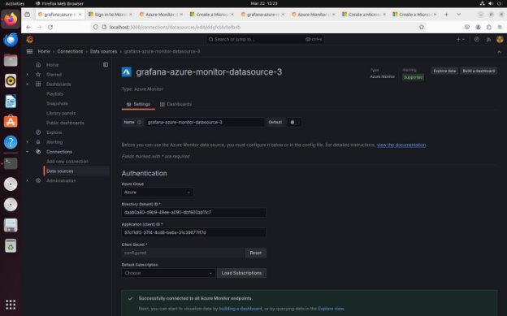
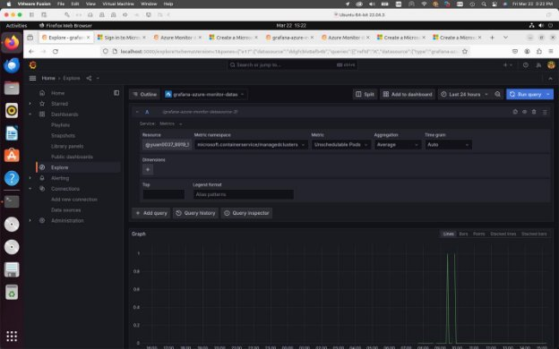

Dev-Sec Ops Assignment 22 

 2024

Assignment 1

MONITORING A KUBERNETES-HOSTED APPLICATION USING SSO WITH GMAIL, SYSLOG, AZURE LOG ANALYTICS, AND GRAFANA 

GROUP MEMBERS: BO YUAN, SHIFENG SONG, YINGDA ZHANG, KENAN YUSUF | 

PRESENTED TO: ISLAM GOMAA |   03/22/2024 

[Code Repo..................................................................................................................................... 2 ](#_page1_x69.00_y334.00)[Introduction ................................................................................................................................... 2](#_page1_x69.00_y446.00)

[Architecture (Phase I) ..................................................................................................................... 3 ](#_page2_x69.00_y478.00)[Deployments ............................................................................................................................ 5 ](#_page4_x69.00_y629.00)[Deployments of syslog server and client pods .................................................................... 5 ](#_page4_x69.00_y661.00)[Deployment of Web-APP Google SSO Pod ........................................................................ 7 ](#_page6_x69.00_y644.00)[Architecture (Phase II)............................................................................................................... 12 ](#_page11_x69.00_y147.00)[Deployments .......................................................................................................................... 13 ](#_page12_x69.00_y512.00)[Grafana ...................................................................................................................................... 16 ](#_page15_x69.00_y393.00)[Conclusion ................................................................................................................................. 20 ](#_page19_x69.00_y381.00)[References ................................................................................................................................ 21](#_page20_x69.00_y664.00)

Code Repo 

Github Address[**: https://github.com/luckyeven/k8s-google-sso.git** ](https://github.com/luckyeven/k8s-google-sso.git)

Introduction  

In this assignment, we tackled a comprehensive exploration of monitoring and managing system logs through Azure Grafana, coupled with the deployment of a React web application that incorporates Google Single Sign-On (SSO) for authentication, all within a Kubernetes environment. Our initial approach was methodical, beginning with the establishment of a syslog server and client, alongside the deployment of the React SSO web page. This foundational step allowed us to delve into the intricacies of Kubernetes services, which facilitated IP routing for each pod, thereby ensuring seamless communication and functionality within our setup. As our investigation progressed, we identified opportunities to refine our project. This led to a focused approach, where we prioritized the deployment of the React web page. A key aspect of our refined strategy involved the direct transmission of syslogs from the cluster to Azure Log Monitor. This decision was not made lightly; it was informed by a desire to streamline our operations and enhance the efficiency of our monitoring processes. By doing so, we were able to gain invaluable insights into the cluster's performance, thereby elevating our understanding of the system's dynamics and operational capabilities.  

Our journey through this assignment was characterized by a series of strategic decisions and adjustments, all aimed at optimizing our setup for better performance and more insightful analysis. Through this process, we not only honed our technical skills but also developed a deeper appreciation for the complexities and challenges of managing and monitoring applications in a distributed cloud computing environment. This experience has underscored the importance of flexibility, strategic planning, and continuous learning in this field.  

Architecture (Phase I) 

This schematic outlines the operational flow of a system designed for log management and application deployment, leveraging the capabilities of Kubernetes and Azure. At the core of this system, users engage with applications hosted on a Kubernetes cluster, where authentication is managed through Google's Single Sign-On (SSO) mechanism.  

The Kubernetes cluster serves as the foundational infrastructure, hosting various applications and services within its architecture. It is composed of multiple pods, each capable of mutual communication, thereby fostering an integrated environment for the hosted applications. Networking within this cluster is facilitated by Kubernetes Services, which ensure seamless connectivity among the pods as well as with external networks, thereby extending the cluster's reach beyond its internal confines.  

Monitoring and performance analysis of the cluster are conducted through Azure Monitoring. This tool plays a pivotal role in ensuring the optimal functioning of the cluster by providing insights into its performance and health metrics.  

Within the confines of the Kubernetes cluster, the deployment unfolds as follows:  

- **Web Application Node**: A pod, identified as **google-deployment**, hosts a React web application. This application is distinguished by its implementation of Google SSO, facilitating user authentication. User activities, such as signing in or out, trigger the generation of logs, which are then dispatched to a syslog server through a **/logs** API endpoint.  
- **Syslog Client Node**: Operating within the **syslog-client-deployment** service, this pod acts as a syslog client. Its primary function is to capture logs from the web application and relay them to the syslog server, thus serving as an intermediary in the log collection process.  
- **Syslog Server Node**: Identified as **syslog-server**, this pod aggregates logs received from the syslog client. It may also engage in further processing of these logs.  
- **Flask Component**: A Flask application, listening on port 5000, plays a crucial role in forwarding incoming messages to the syslog server, thus contributing to the log compiling mechanism.  

The workflow proceeds as follows: Users access the React web application deployed within the Kubernetes cluster, where Google SSO manages authentication. Subsequent events, such as user sign-ins or sign-outs, prompt the web application to generate and send logs to the syslog client via the **/logs** endpoint. These logs are then collected by the syslog client and forwarded to the syslog server for aggregation and potential processing. The syslog server interfaces with Azure Monitoring, enabling the analysis of the cluster's performance based on the aggregated logs. Through continuous monitoring, Azure Monitoring ensures the cluster's health and performance are maintained at optimal levels, informed by the comprehensive log data received from the syslog server.  

Deployments 

*Deployments of syslog server and client pods* 

ComputingPost. (n.d.). *Configure rsyslog centralized log server on Ubuntu*  

*22.04/20.04/18.04*. Retrieved from[ https://computingpost.medium.com/configure- rsysloghttps://computingpost.medium.com/configure-rsyslog-centralized-log-server-on- ubuntu-22-04-20-04-18-04-b5222129b3f3centralized-log-server-on-ubuntu-22-04-20-04-18- 04-b5222129b3f3  ](https://computingpost.medium.com/configure-rsyslog-centralized-log-server-on-ubuntu-22-04-20-04-18-04-b5222129b3f3)

1. Create syslog server pod: kubectl apply -f rsyslog-server-deployment.yaml   
1. Create syslog server service: kubectl apply -f rsyslog-server-service.yaml  
   3. Get all services on the cluster

In this case 10.110.45.100  

4. Create syslog client  
1. Replace the ip address in the following file (to point to the correct syslog server 

container) 

2. Apply the deployment of client pod.  

kubectl apply -f .\rsyslog-client-deployment.yaml         Test:  execute this command in syslog client: logger "test”.   

` `Then go to the server. CD into the directory cd /var/log  , you will see the rsyslog-flient-\*\*\* is created.   Navigate into that folder, cat root.log 

Two logs are received.  

*Deployment of Web-APP Google SSO Pod* 

1\.  Google-SSO pod deployment 

` `Google sso sign in and out, implemented with React. Also sends logging information to syslog client through API/logs  

First step is to get the client id from google by creating a new application.  

Muhammed, S. (n.d.). *React JS: A step-by-step guide to Google Authentication*. Retrieved from [https://medium.com/@sahadmuhammed289/react-js-a-step-by-step-guide-to- googlehttps://medium.com/@sahadmuhammed289/react-js-a-step-by-step-guide-to- google-authentication-926d0d85edbdauthentication-926d0d85edbd  ](https://medium.com/@sahadmuhammed289/react-js-a-step-by-step-guide-to-google-authentication-926d0d85edbd)

Steps for deployment.  

1. Kubectl get svc  
1. Replace address(since i am using docker k8s, which does not have load balancer, so i need to do a port forwarding for the service. In development it is okay, when it comes to production , this should be the actual address of kube services .)  

3. Build docker file. 
3. Push docker file. 
5. kubecrl apply google-sso-deployment.yaml (change the image with your own)  
5. kubectl apply google-sso-service.yaml  
5. Because docker K8s doesn’t provide external ip address so we need to forward the port   
1. Find the pod name using kubectl get pods 

2. We need to do port forwarding for syslog-client-service as well. Again this is not a good practice in production,but in development its okay.  

   The service pod name is .  

8. kubectl port-forward google-sso-785d974f65-t6qpf 8080:80 kubectl port-forward rsyslog-server-7b4dcd594d-kvvhb 5000:80 

9. Go to browser: http://localhost:8080/ 

10. success  

b. Back-end:  

receives logs from front-end, then forwards to syslog server  

We used Flask for backend endpoints. To do so the docker file needs to be updated. 

Update rsyslog.conf file to monitor /var/log/webapp.log and forward the logs  

Create docker image, and push to docker hub docker build -t shifeng1428/rsyslog- client:latest . 

docker push shifeng1428/rsyslog-client  

kubectl apply -f rsyslog-client-development.ymal  

From the rsyslog server  

Receives logging informations  

Use cat/var/log/rsyslog-client-769f449949 to display logs received from syslog client.  

Architecture (Phase II) 

After the extensive testing and troubleshooting on the local K8S extension with Docker on the local computer, we realized there are too many configuration steps and too many moving parts. Such as the syslog server and client’s IP address in AKS cluster could be changed without any notice. After careful research and testing, we figured out more straight-forward way to transfer all syslogs from AKS cluster to Azure Log Analytics. We carefully examined the requirements of the assignment and agreed on the more straight-forward approach.  

At the outset of this workflow stand the users, engaging directly with the web application housed in the Kubernetes cluster. This cluster acts as the hosting environment for the React application which benefits from the orchestration and networking capabilities of Kubernetes services. These services are instrumental in facilitating the application's deployment and ensuring seamless interconnectivity.  

Within this schema, the node hosting the React web application, identified as **google- deployment**, marks a departure from the prior arrangement. Here, the application employs an npm module for the direct transmission of login data to the Azure log database. This refinement streamlines the logging architecture, diminishing the complexity by reducing intermediary processes. Such an approach holds the promise of enhancing the logging mechanism's efficiency and reliability.  

Moreover, Azure Monitoring extends its oversight beyond application logs to encompass the syslogs from the virtual machines that underpin the Kubernetes cluster. This direct link fosters an immediate and thorough examination of both performance and system logs across the entire cluster, offering a thorough view of its operational health and activities.  

To summarize, this enhanced iteration allows a more direct and efficient logging process. The React web application leverages npm modules for immediate interaction with the Azure log database concerning authentication logs. At the same time, the virtual machines within the Kubernetes framework transmit syslogs directly to Azure Log Monitor, showcasing a more streamlined method in logging and monitoring operations.  

Deployments 

1. Deployment of google-sso 

2. Deployment of a Custom Domain 

A custom domain and sub domain with DNS zone were set up with Azure DNS Zones (required for Google SSO’s origin and redirection to work properly) 

3. Go to the URL of the sub domain [(https://aks.yuan37.com)](https://aks.yuan37.com/) and sign in.  

.  

4. Enable “Insights” for the cluster.  

5. Verify the syslogs in Azure Log Analytics. 

6. Done 

Grafana 

1. Installation according to the instructions at [https://grafana.com/docs/grafana/latest/setup-grafana/installation/debian/ ](https://grafana.com/docs/grafana/latest/setup-grafana/installation/debian/)

2. Create a new “App Registration” in azure called “grafana” and add the reader role assignment to the new app registered.  

3. Use the credentials and settings of the “grafana” app added in Azure to set up the datasource in Grafana  

4. Create a dashboard and get live data. 

Conclusion  

1. A custom domain is required to host a Google SSO app on AKS cluster because Google will automatically verify the origin and redirection URL when the sign on request is received. If it does not match, you will see similar error message as following.  

2. A self-hosted or on-prem Grafana can only connect to Azure Log Analytics using a set of credentials of a registered app in Azure subscription where the Azure Log Analytics are hosted. To register the app, you need to have “Application Administrator” role. Once the app is registered in Azure via “App Registration”, the app needs to be assigned with “Reader” role for Grafana to connect through it to your Log Analytics.  
2. AKS cluster’s syslog can be seamlessly transmitted to Azure Log Analytics through “Insights” without any intermediary syslog servers.  
2. We switched to different subscriptions and provisioned different sets of AKS cluster because of the blockers we experienced below. In the end, we were able to successfully connect Grafana to Azure Log Analytics and consume/render the chart from all kinds of metrics data we got from the AKS cluster that hosts the Google SSO app.  
1. No custom domain name to support deployed SSO service on AKS.  
1. No “Application Administrator” role for our account under Algonquin directory. 
1. Not able to add “reader” role on the application we created that will be used by Grafana to connect to Azure.  

References 

Bwren. (n.d.). *Syslog collection with container insights - azure monitor*. Azure Monitor | 

Microsoft Learn. https://learn.microsoft.com/en-us/azure/azure- monitor/containers/container-insights-syslog  

ComputingPost. (2022, October 15). *Configure rsyslog centralized log server on ubuntu 22.04:* 

*20.04: 18.04*. Medium. https://computingpost.medium.com/configure-rsyslogcentralized- log-server-on-ubuntu-22-04-20-04-18-04-b5222129b3f3  

*Install grafana on debian or ubuntu: Grafana documentation*. Grafana Labs. (n.d.). 

https://grafana.com/docs/grafana/latest/setup-grafana/installation/debian/  
22 
